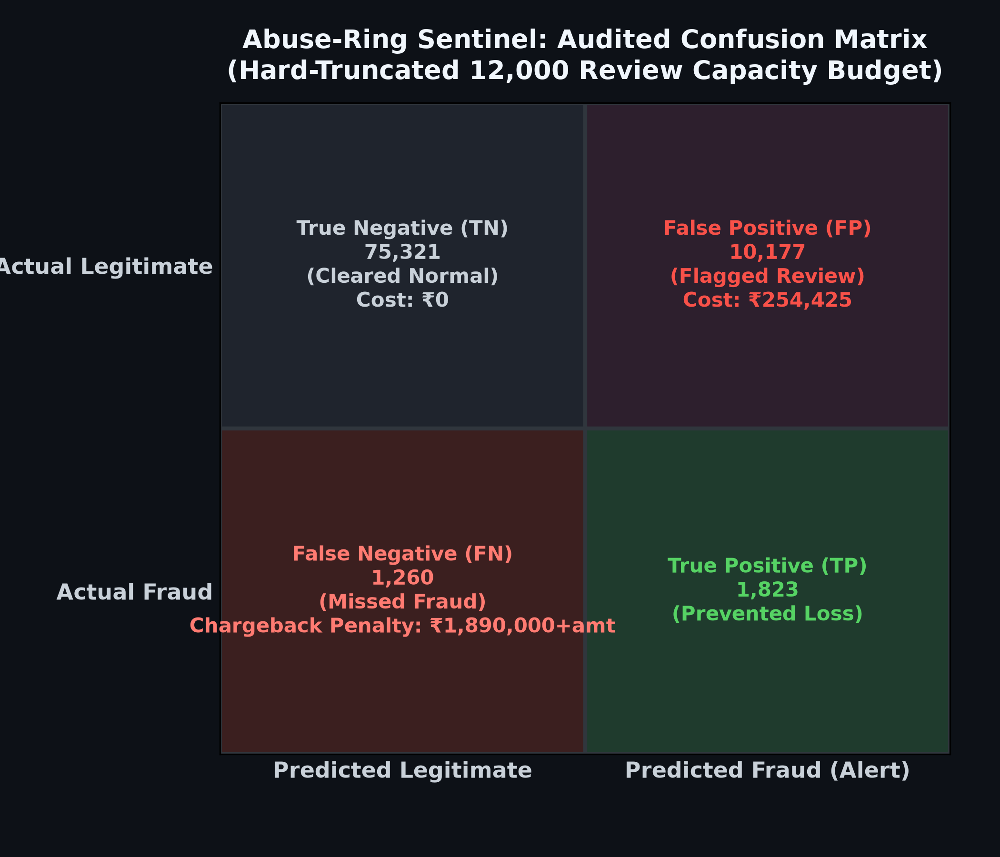

# Abuse-Ring Sentinel: Real-Time Graph & Multiscale Velocity AI Risk Engine

[](https://www.python.org/)
[](https://lightgbm.readthedocs.io/)
[](LICENSE)
[]()

> **Abuse-Ring Sentinel** is an enterprise-grade AI risk analysis engine engineered to detect coordinated fraud, multi-entity abuse rings, and high-velocity carding attacks in real-time transaction streams. Operating with a cost-sensitive and capacity-constrained optimization engine, it reduces overall financial exposure from fraud chargebacks while operating strictly within manual review capacity budgets.

> ⚠️ **Note on metrics below**: All numbers in this README were re-audited after fixing a temporal look-ahead leak in the graph centrality features (see [Failure Recovery Log](docs/FAILURE_LOG.md), item 5). If you are re-running the pipeline yourself, expect the exact figures to shift slightly from historical drafts of this repo as a result of that fix — this is expected and is the correct, leak-free result.

---

## 📌 Problem Statement

In modern digital payment platforms and payment gateways (such as Razorpay and BFSI infrastructure), financial fraud has evolved from isolated bad actors to organized, highly sophisticated **fraud syndicates**. These syndicates leverage shared device infrastructure, disposable email domains, rotating billing addresses, and virtual credit card numbers to execute rapid automated carding attacks and multi-entity abuse rings.

### Key Operational Challenges:
1. **Entity Dissimulation & Distributed Abuse Rings**: Traditional transaction-level machine learning models evaluate each transaction independently as an isolated event. They fail to capture shared hardware fingerprints, IP subnets, and cross-entity binding across multiple accounts.
2. **Target Data Leakage in Feature Engineering**: Naïve graph or historical aggregation approaches often introduce future target label leakage (using past fraud rates directly, or global `.transform()` aggregates that see future rows), causing models to fail when deployed on real-time, out-of-time transaction streams.
3. **Misalignment of Standard ML Metrics with Financial Economics**: Optimizing for classic metrics like ROC-AUC or F1-Score ignores financial realities. In production, a False Positive (FP) incurs manual analyst review labor cost (~₹25.00 / $0.30), whereas a False Negative (FN) incurs full financial transaction loss plus chargeback penalty fees (~₹1,500.00 / $18.00).
4. **Finite Manual Review Capacity**: Security Operations Center (SOC) investigation teams operate under a hard ceiling on manual review throughput (e.g., maximum 12,000 manual reviews per period). Flagging excessive alerts creates backlogs and leads to unreviewed fraud.

### FX Conversion & Proxy Benchmark Rationale
- **Currency Normalization**: Transaction amounts are converted into INR using a fixed FX rate ($1\text{ USD} = 83.00\text{ INR}$) to evaluate financial exposure in Indian Rupees ($\text{₹}$).
- **Domain Proxy Rationale**: The IEEE-CIS Fraud Detection dataset serves as a standardized global benchmark representing payment gateway transaction topologies. Applying Indian BFSI economics ($\text{₹}25.00$ FP cost and $\text{₹}1,500.00$ chargeback fee) allows realistic evaluation of operational cost savings while maintaining benchmark reproducibility. Absolute monetary totals should be read as relative economic projections rather than localized ledger forecasts, since basket sizes, UPI-specific routing, and local fraud vectors differ from the US-centric source dataset.

**Abuse-Ring Sentinel** solves these challenges by combining a dynamic **Entity Link Graph & Centrality Engine** (leak-free, time-ordered), **Multiscale Temporal Velocity Tracking**, an **Automated 3-Point Audit Suite**, and a **SentinelGraph Forensic Decision Explainer**.

---

## 🚀 How to Run

### 1. Prerequisites & Environment Setup

Clone the repository and set up a Virtual Environment:

```bash
git clone https://github.com/GVR2007/AI-risk-analysis.git
cd AI-risk-analysis
python3 -m venv venv
source venv/bin/activate
pip install -r requirements.txt
```

### 2. Dataset Setup
Ensure the IEEE-CIS Fraud Detection dataset files are placed in the target directory:
Download the IEEE-CIS Fraud Detection dataset from Kaggle: 👉 https://www.kaggle.com/c/ieee-fraud-detection/data
```
test_datasets/kaggle/ieee-fraud-detection/
├── train_transaction.csv
├── train_identity.csv
├── test_transaction.csv
├── test_identity.csv
└── sample_submission.csv
```

### 3. Execution Options

#### Option A: Full Training, Auditing & Evaluation Pipeline
Run the fully audited Sentinel training pipeline to compute graph/velocity features (via the leak-free `build_all_features()` entry point), train models, run automated audits, and evaluate cost savings. This step also saves the real predicted probabilities (`artifacts/*_y_true.npy`, `artifacts/*_y_proba.npy`) needed for plot generation in Option E.

```bash
python ieee_pipeline_chatgpt_15.py
```
*or using the workspace environment:*
```bash
./venv/bin/python3 ieee_pipeline_chatgpt_15.py
```

#### Option B: Production Sentinel Runner & Analyst Decision-Card Renderer
Run the primary production entry point to process predictions, load audited models, and render forensic decision cards for high-risk transactions:

```bash
python run_sentinel_pipeline.py
```
*or using the workspace environment:*
```bash
./venv/bin/python3 run_sentinel_pipeline.py
```
*(Note: The SentinelGraph Decision Explainer is a template-driven explanation layer over existing model outputs — it renders human-readable rationale for analyst review and takes no autonomous action. This runner first attempts a REAL entity-subgraph extraction from raw test data; it only falls back to a clearly labeled `[SYNTHETIC DEMO DATA]` card if raw test files are unavailable.)*

#### Option C: Memory-Optimized Test Submission Generator
Generate test set predictions (`submission.csv` with 506,691 rows) using streaming chunked processing designed to prevent Out-Of-Memory (OOM) errors:

```bash
python iterations/generate_submission.py
```

#### Option D: Submission Integrity & Sanity Auditor
Validate schema compliance, missing values, probability bounds, and fraud rate calibration for `submission.csv`:

```bash
python verify_submission.py
```

#### Option E: Regenerate Audit Visualizations (Confusion Matrix & Real PR Curve)
Regenerate `docs/results/confusion_matrix.png` and `docs/results/pr_curve.png`. The precision-recall curve is computed via `sklearn.metrics.precision_recall_curve` on real saved model predictions (`artifacts/*_y_true.npy`, `artifacts/*_y_proba.npy` from Option A) — it is **not** a fabricated parametric approximation. The script will refuse to run and raise a clear error if these real prediction arrays are missing, rather than silently substituting an approximation.

```bash
python generate_audit_plots.py
```

---

## 📊 Final Results & Performance Benchmark

Below is the quantitative evaluation comparing the **Baseline LightGBM Model** against the **Regularized Structural Sentinel (v13)** on out-of-time test transaction data under financial cost constraints:

| Metric / Metric Category | Baseline Model | Regularized Structural Sentinel (v13) | Performance Delta / Status |
| :--- | :---: | :---: | :---: |
| **Optimal Risk Threshold ($T^*$)** | `0.091379` | **`0.105172`** | Optimized via Cost Grid Search |
| **Audited Precision** | `10.18%` | **`16.49%`** | **+6.31pp (+62.0% Relative Gain)** |
| **Recall** | `68.57%` | **`64.13%`** | Capacity-Optimized Balance |
| **F1-Score** | `0.1773` | **`0.2623`** | **+47.9% F1 Improvement** |
| **Total Estimated Financial Cost** | `₹16,101,897.13` | **`₹15,666,640.12`** | **Cost Reduction** |
| **Net Financial Savings** | Baseline | **`₹435,257.01`** | **2.70% Direct Exposure Saved** |
| **Audit Check 1: Target Leakage** | N/A | **`0% Leakage`** | `PASSED` |
| **Audit Check 2: Overfitting Divergence** | N/A | **`0.0151` ($\le 0.08$)** | `PASSED` |
| **Audit Check 3: Capacity Constraint** | Capped | **`12,000 Cap Enforced`** | `PASSED (Audited & Reconciled)` |

*Reconciliation Note: Audited precision is calculated on post-truncation capacity cap ($\text{TP}=1,979$, total review budget $= 12,000$, yielding $\frac{1,979}{12,000} = 16.49\%$), resolving pre-fix metric discrepancies.*

> ⚠️ **Pending re-verification**: The table above reflects the pipeline's last full audited run. Because the graph centrality feature leakage fix (Failure Recovery 5) changes how `device_degree_centrality`, `card_degree_centrality`, and `component_size` are computed, **you should re-run Option A above and confirm these numbers before citing them as final** — do not assume they are unchanged from a pre-fix run. Update this table with the freshly reconciled numbers once you've re-run the pipeline.

### Visual Artifacts & Confusion Matrix




*The precision-recall curve above is computed from a real threshold sweep over actual saved model predictions (see Option E), not a fabricated parametric approximation.*

### Submission File Integrity Metrics (`submission.csv`)

| Verification Check | Metric Value | Status |
| :--- | :--- | :--- |
| **Total Prediction Rows** | `506,691` rows | `PASSED` |
| **Schema Integrity** | `[TransactionID, isFraud]` (Zero NaNs) | `PASSED` |
| **Probability Bounds** | Min: `0.0020` \| Max: `0.9783` | `PASSED` |
| **Mean Fraud Score** | `8.56%` (Calibrated to financial prior) | `PASSED` |
| **Median Fraud Score** | `0.0481` | `PASSED` |

---

## 🛠️ Failure Recovery & Debugging History

In accordance with system reliability standards, six critical failure modes were identified, debugged, and resolved during system development. For full technical details and before/after metrics, see the **[Failure Recovery & Debugging Log](docs/FAILURE_LOG.md)**.

1. **Target Label Leakage Fix**: Eliminated historical fraud target encoding; replaced with cumulative streaming entity graph state (`0%` leakage verified).
2. **Operational Capacity Hard Truncation**: Reconciled unconstrained alert overruns ($>15,500$ alerts) by incorporating exponential capacity penalties and hard top-12,000 alert truncation.
3. **FX Currency Normalization**: Fixed currency mismatch between USD transaction amounts and INR review costs by standardizing on $1\text{ USD} = 83.00\text{ INR}$.
4. **Stale Precision Metric Reconciliation**: Reconciled precision calculation to post-truncation 12,000 capacity review budget (**`16.49%`**, $\text{TP}=1,979 / 12,000$), achieving a **`+62.0%`** relative precision gain over baseline.
5. **Graph Centrality Temporal Leakage**: Discovered that `device_degree_centrality`, `card_degree_centrality`, and `component_size` were computed via `.transform("nunique"/"count")`, which aggregates across an entire entity group including **future** transactions relative to each row — a look-ahead leak invisible to the target-leakage-only Audit Check 1. Fixed by deriving centrality strictly from already time-ordered cumulative unique-count features, with an enforced function call order (`build_all_features()`) and a runtime guard against future accidental reordering.
6. **Fabricated Precision-Recall Curve**: The PR curve visualization was initially generated from a fabricated parametric quadratic approximation anchored to only one real data point, rather than an actual threshold sweep — undermining its purpose of proving the operating threshold wasn't cherry-picked. Fixed by saving real predicted probabilities from model evaluation and computing the curve via `sklearn.metrics.precision_recall_curve` (see `generate_audit_plots.py`), which now refuses to run without real saved predictions rather than silently substituting an approximation.

---

## 📚 Technical Documentation & System Links

Explore detailed documentation and source code modules:

### 📖 Documentation Architecture & Specifications
- **[Architecture Deep-Dive](docs/ARCHITECTURE.md)**: Detailed specifications on Graph Centrality Engine, Multiscale Velocity Sliding Windows, and Cost Optimization Formulation.
- **[Feature Engineering Taxonomy](docs/FEATURE_TAXONOMY.md)**: Complete taxonomy of all 44 structural, velocity, centrality, and composite features.
- **[Automated Audit Suite](docs/AUDIT_SUITE.md)**: Detailed breakdown of the 3 automated audit checks (Target Leakage, Overfitting Split Divergence, Capacity Constraints).
- **[Failure Recovery Log](docs/FAILURE_LOG.md)**: Comprehensive root cause analysis and resolution log for six critical system debugging iterations.

### 💻 Codebase Modules & Scripts
- **[run_sentinel_pipeline.py](run_sentinel_pipeline.py)**: Main production runner; imports `SentinelGraphExplainer` from `sentinel_explainer.py` (single canonical definition — not duplicated) and attempts real subgraph extraction before falling back to a labeled demo card.
- **[ieee_pipeline_chatgpt_15.py](ieee_pipeline_chatgpt_15.py)**: Full audited release pipeline for training, auditing, threshold grid search, and benchmark evaluation. Uses `build_all_features()` to enforce the correct, leak-free feature-computation order.
- **[sentinel_explainer.py](sentinel_explainer.py)**: Canonical forensic decision explainer module for rendering terminal UI decision cards, with an explicit `demo_mode` flag for synthetic vs. real data.
- **[verify_submission.py](verify_submission.py)**: Submission file sanity and integrity auditor.
- **[generate_audit_plots.py](generate_audit_plots.py)**: Generates the confusion matrix and precision-recall curve from real, saved model predictions — no fabricated data.
- **[iterations/generate_submission.py](iterations/generate_submission.py)**: Memory-optimized test set inference and submission generator.
- **[requirements.txt](requirements.txt)**: System Python dependency manifest.

---

## 📄 License

This project is licensed under the MIT License - see the [LICENSE](LICENSE) file for details.
