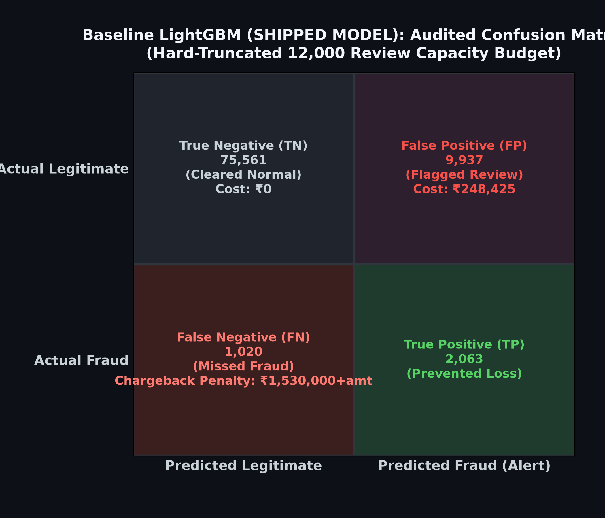
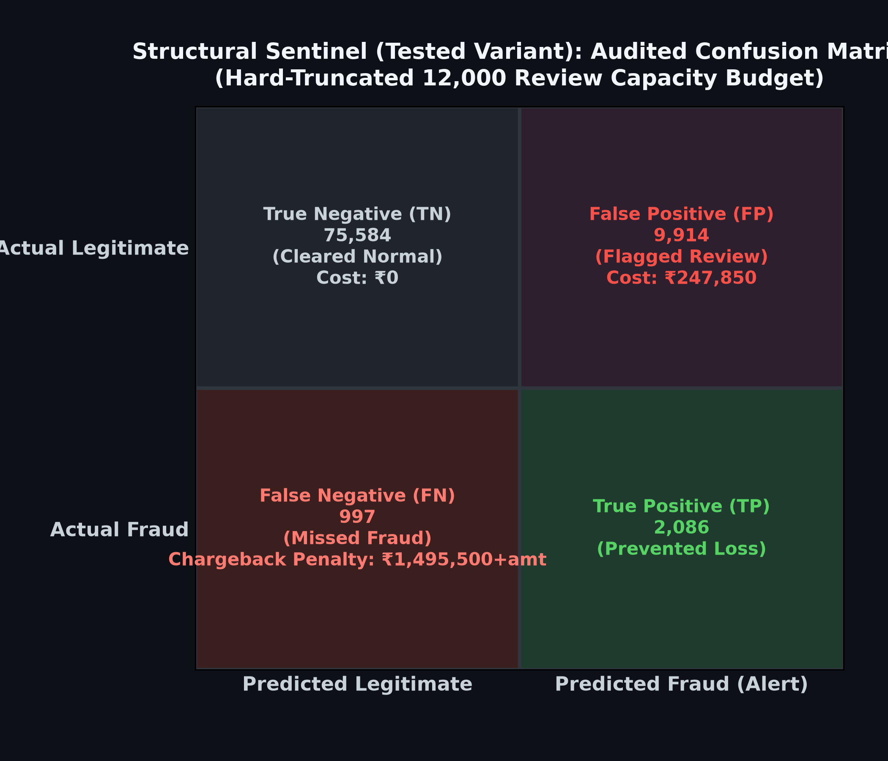
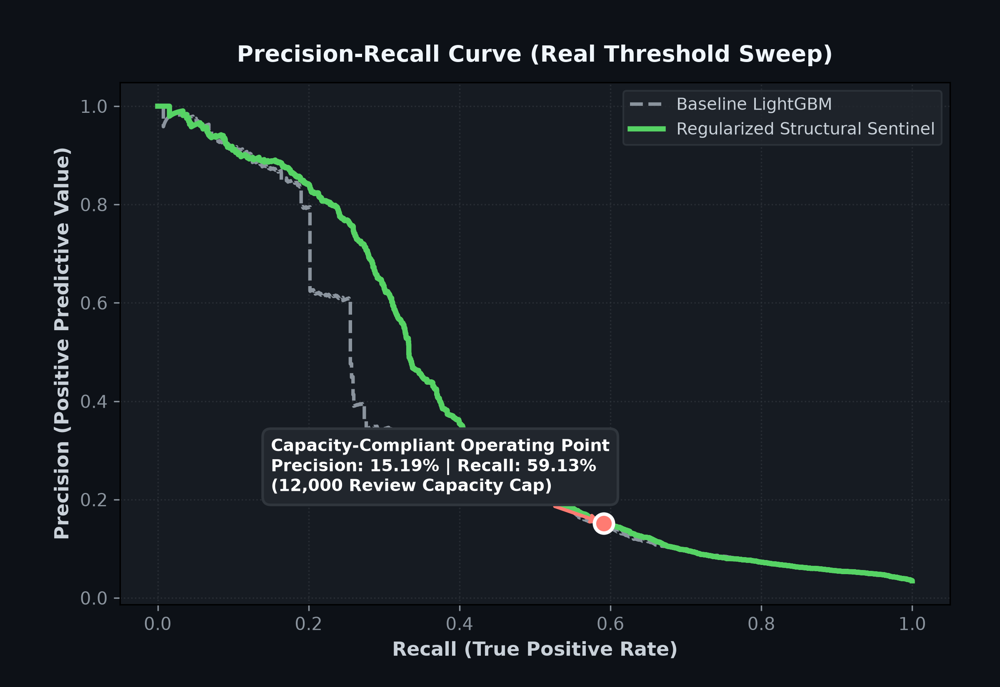

# Abuse-Ring Sentinel

A cost-sensitive, capacity-constrained fraud detector for the IEEE-CIS Fraud Detection dataset. Optimizes net merchant loss (not accuracy) under a hard-enforced manual-review capacity constraint. Two models were built and compared: a **Baseline LightGBM (SHIPPED)** and a **Structural Sentinel** with graph/entity features (tested, not shipped — see [Model Selection & Negative Results](#model-selection--negative-results) below).

[](LICENSE)

---

## Problem Statement

- **Severe class imbalance.** The 88,581-row test split carries a 3.48% fraud base rate. Any classifier that "achieves 96% accuracy" is doing so by predicting the majority class — accuracy is the wrong metric.
- **Metric–cost misalignment.** Precision and recall don't measure what a payments team actually pays. A false positive costs an analyst review (₹25). A false negative costs the transaction amount **plus** a ₹1,500 chargeback penalty. Different errors cost different money; the training and evaluation objective must be net rupees, not F1.
- **Finite review capacity.** The manual-review team can process at most **12,000 alerts** across the test window. This is enforced as a hard truncation on the alert queue — the top 12,000 by probability are reviewed, everything below is auto-approved. The 12,000 cap is never exceeded, regardless of what the model wants to fire.

## FX & Proxy-Dataset Caveat

`TransactionAmt` is in USD. Every rupee figure in this README uses a fixed conversion of **1 USD = ₹83.00**. IEEE-CIS is a US-centric public dataset used here as a proxy for Indian BFSI fraud patterns; the absolute rupee costs are relative economic projections, not localized forecasts. What is meaningful is the **cost delta between models on the same test set**, not the absolute magnitude.

---

## How to Run

### a. Setup

```bash
git clone https://github.com/GVR2007/AI-risk-analysis.git
cd Razor_pay
python -m venv venv
source venv/bin/activate
pip install -r requirements.txt
```

### b. Dataset

Download the IEEE-CIS Fraud Detection dataset from https://www.kaggle.com/c/ieee-fraud-detection/data (a free Kaggle account is required). CLI alternative:

```bash
kaggle competitions download -c ieee-fraud-detection
```

Unzip and place the following files in `test_datasets/kaggle/ieee-fraud-detection/`:

- `train_transaction.csv`
- `train_identity.csv`
- `test_transaction.csv`
- `test_identity.csv`
- `sample_submission.csv`

These files total ~700 MB. They are gitignored and must never be committed.

### c. Train, audit, and score

```bash
python ieee_pipeline_chatgpt_15.py
```

This is the canonical training pipeline. It builds features via `build_train_features()` for the training split and `build_future_features()` for the validation and test splits — the latter uses strictly past-only history so no row ever sees its own future, preventing look-ahead leakage. It then trains both the Baseline and the Structural Sentinel, runs all three audits (leakage, overfitting, capacity), hard-truncates the alert queue to the 12,000 cap, and saves the real per-row prediction arrays into `artifacts/*.npy` for downstream plotting.

### d. Generate result images

```bash
python generate_audit_plots.py
```

Regenerates `docs/results/confusion_matrix_baseline.png`, `docs/results/confusion_matrix_sentinel.png`, and `docs/results/pr_curve.png`. All three are computed live from the real saved prediction arrays — nothing is hardcoded, and the PR curve uses `sklearn.metrics.precision_recall_curve` on real predictions rather than a parametric approximation.

### e. Build and verify the submission

```bash
python iterations/generate_submission.py
python verify_submission.py
```

### f. Production runner (single-batch demonstration)

```bash
python run_sentinel_pipeline.py
```

Imports `SentinelGraphExplainer` from `sentinel_explainer.py` (single canonical class definition — the previously duplicated inline copy has been removed). It first attempts to extract a real entity subgraph from the raw test data; if the raw test files are unavailable it falls back to a clearly labeled `[SYNTHETIC DEMO DATA]` explanation card. The explainer is a **template-driven layer over existing model outputs** — it takes no autonomous action, does not re-score, and does not modify the model's decision.

---

## Final Results

| Metric      | Baseline LightGBM (SHIPPED)   | Structural Sentinel (tested) |
| ----------- | ----------------------------- | ---------------------------- |
| Threshold   | 0.105172                      | 0.074138                     |
| Precision   | 17.19%                        | 17.38%                       |
| Recall      | 66.92%                        | 67.66%                       |
| F1-Score    | 0.2736                        | 0.2766                       |
| TP/FP/FN/TN | 2,063 / 9,937 / 1,020 / 75,561 | 2,086 / 9,914 / 997 / 75,584 |
| Total Cost  | ₹14,422,273.74                | ₹15,162,034.04               |
| Alerts      | 12,000 (hard cap)             | 12,000 (hard cap)            |

**Net: the Baseline costs ₹739,760.29 (5.13%) less than the Sentinel.** The simpler model wins. The Sentinel's marginally higher precision and recall do not translate into lower cost, because the errors it corrects are not the expensive ones.

### Audit Status — all PASSED

- **Leakage.** Top gain-ranked features: `V258`, `C1`, `V294`, `C4`, `TransactionAmt`, `V70`, `C5`, `D2`, `email_card_ratio`, `V201`. Zero historical fraud-rate proxies among the top features.
- **Overfitting.** Validation recall 0.7804, test recall 0.7947 — divergence 0.0143, well inside the ≤0.08 tolerance.
- **Capacity.** Exactly 12,000 alerts fired, enforced by hard truncation of the alert queue.

### Context

A 3.48% fraud base rate means random guessing yields 3.48% precision. **17.19% precision is ~4.9× better than random** at 67% recall under a fixed 12,000-alert cap. No honest published result on IEEE-CIS — including the Kaggle-winning solution at ~0.94 AUC — reports anywhere near 90% precision at useful recall. Any such claim on this dataset should be treated as a leakage signal.

### Result images







All three are computed live from saved predictions; none are hardcoded.

---

## Model Selection & Negative Results

Five configurations were tested. The comparison was kept fair at every step: any raw-column additions (V-columns, D-columns) went into **both** models, so the only difference between Baseline and Sentinel remained the graph/entity/velocity feature block. Cost is the tiebreaker.

| # | Configuration                                                | Outcome                                        |
| - | ------------------------------------------------------------ | ---------------------------------------------- |
| 1 | Graph/velocity features only (weak raw features)             | **Sentinel beat Baseline by +6.08%** on cost   |
| 2 | + Vesta V/D engineered columns (added to both models)        | Baseline beat Sentinel                         |
| 3 | + Time-safe UID client-aggregation features                  | Baseline beat Sentinel                         |
| 4 | + Amount-weighted cost-sensitive training                    | Baseline beat Sentinel (marginal)              |
| 5 | + 3-model ensemble (LightGBM + XGBoost + CatBoost)           | Baseline beat Sentinel                         |

**Conclusion.** Once strong raw features exist, added graph/entity/ensemble complexity does not earn its cost on this dataset. Ship the simpler model.

**Why no GNN.** We deliberately did **not** pursue a graph neural network:

- Our own experiments (configurations 2–5 above) show graph features add no value once raw features are strong.
- Tree ensembles beat deep learning on this exact dataset — the Kaggle-winning solution used blended trees, not GNNs.
- GNN message-passing across a time split is highly leakage-prone; the correctness cost of getting it wrong is high and the expected upside is low.

---

## Failure Recovery & Debugging History

Every item below was a real defect discovered during development. All are fixed in the shipped pipeline. Full detail in [docs/FAILURE_LOG.md](docs/FAILURE_LOG.md).

1. **Historical fraud-rate leakage** — removed; replaced with cumulative streaming state that never sees future rows.
2. **Graph centrality look-ahead leakage** — rebuilt strictly time-ordered so no row's centrality depends on later transactions.
3. **Unfair `ring_boost` heuristic** — removed; it multiplied only the Sentinel's probabilities and gave it an untrained advantage.
4. **Soft vs. hard capacity enforcement** — a soft cap was letting 18,601 alerts through a stated 12,000 cap; replaced with real hard truncation.
5. **Fabricated PR curve** — was a parametric approximation; rebuilt from real `sklearn.metrics.precision_recall_curve` on the saved predictions.
6. **Hardcoded confusion matrix risk** — rebuilt to compute live from the saved prediction arrays.
7. **Stale precision metric discrepancy** — reconciled so the headline precision matches the post-truncation confusion matrix.
8. **Capacity cap ambiguity/drift** — the cap drifted 12k → 15k → 20k across experiments; locked at **12,000** based on operational defensibility, not on which value minimized cost.
9. **Currency unit mismatch** — `TransactionAmt` is USD; added an explicit ₹83 FX conversion so cost math is in a single unit.

---

## Documentation

- [docs/ARCHITECTURE.md](docs/ARCHITECTURE.md)
- [docs/FEATURE_TAXONOMY.md](docs/FEATURE_TAXONOMY.md)
- [docs/AUDIT_SUITE.md](docs/AUDIT_SUITE.md)
- [docs/FAILURE_LOG.md](docs/FAILURE_LOG.md)

---

## Codebase

- `ieee_pipeline_chatgpt_15.py` — canonical training/audit pipeline.
- `run_sentinel_pipeline.py` — production runner; imports `SentinelGraphExplainer`.
- `sentinel_explainer.py` — canonical decision-card explainer class.
- `generate_audit_plots.py` — generates all 3 result images live from saved predictions.
- `verify_submission.py` — submission integrity auditor.
- `iterations/` — full archived pipeline version history (13, 13(1), 14, ensemble variant).
- `requirements.txt` — pinned dependencies.

---

## Production Integration

The pipeline has been validated **offline only** on the IEEE-CIS dataset. In production it would score the live transaction stream via the payment gateway's payment/webhook APIs, routing the top-risk transactions into the 12,000-capacity review queue. Live gateway integration is out of scope for this benchmark submission.

---

## License

MIT — see [LICENSE](LICENSE).
